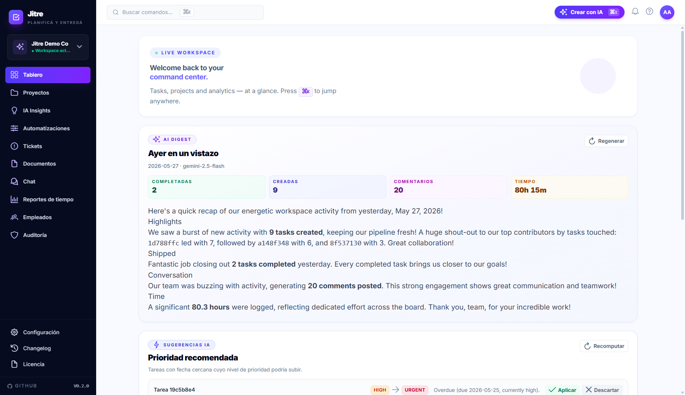
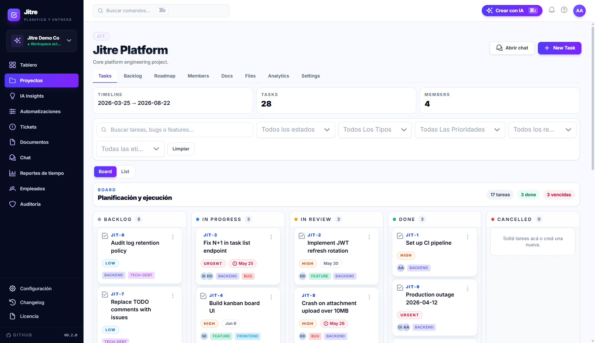
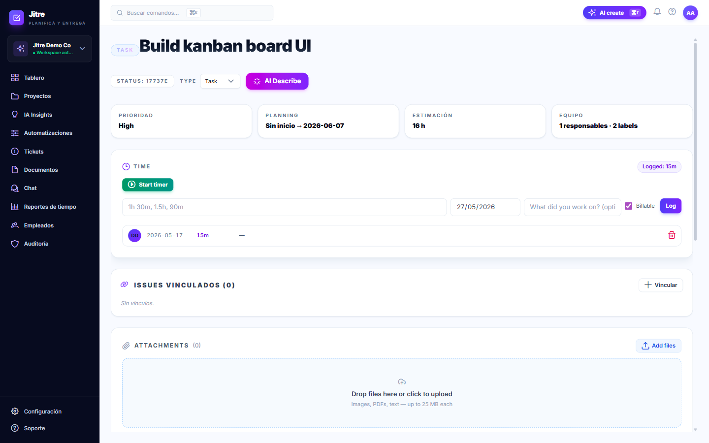
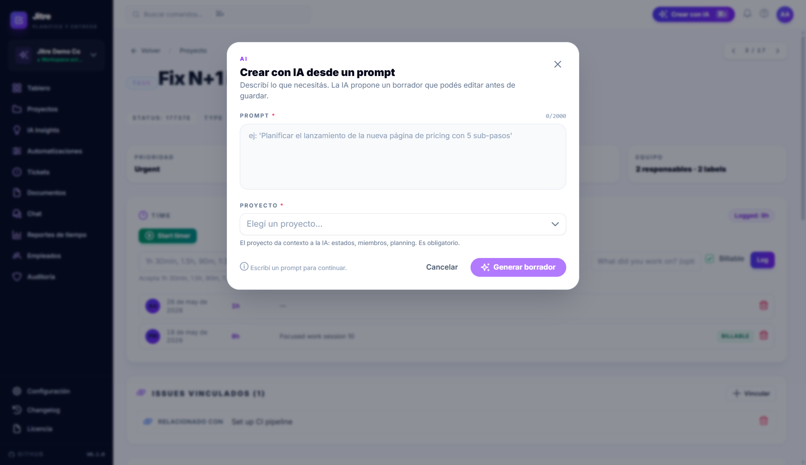

<div align="center">

# Jitre

**Plataforma de gestión de proyectos AI-first — moderna, minimalista, lista para producción.**

[](https://angular.dev)
[](https://nestjs.com)
[](https://www.typescriptlang.org)
[](https://www.postgresql.org)
[](https://redis.io)
[](https://tailwindcss.com)
[](./LICENSE)

[Demo](#capturas) · [Quick start](#quick-start) · [Arquitectura](#arquitectura) · [Contribuir](#contribuciones) · [Autor](#autor)

> Si te resulta útil, **dejá tu ⭐ al repo** — me ayuda muchísimo a que más gente lo descubra y a seguir invirtiéndole tiempo.

</div>

---

## ¿Qué es Jitre?

Jitre es una plataforma de gestión de proyectos pensada para equipos que **valoran la productividad y la simplicidad**. La diferencia: la IA está integrada como una pieza más del workflow — no como un chatbot pegado arriba.

Pensada para reemplazar el combo "Jira + Confluence + Slack + tablero de tiempos" con una sola herramienta coherente.

### ¿Por qué existe?

Las herramientas existentes están **infladas**: 30 menús para hacer 5 cosas. Jitre arranca desde cero con un criterio de UX firme:

- **Atajos de teclado de primera clase** — command palette estilo Linear/Raycast
- **Signals + OnPush en todo** — la UI no se siente como un SPA, se siente como una app
- **AI-first donde aporta** — sub-tareas, priorización, resúmenes, búsqueda semántica
- **Realtime real** — Socket.IO para cambios colaborativos sin recargar

---

## Capturas

> Las capturas se actualizan a medida que avanza el desarrollo. Si querés ver el estado actual, levantá el proyecto siguiendo el [quick start](#quick-start).

<table>
  <tr>
    <td align="center">
      <!-- TODO: reemplazar con captura real -->
      
      <sub><b>Dashboard</b> — vista general del workspace</sub>
    </td>
    <td align="center">
      
      <sub><b>Board</b> — Jira-style workflow por proyecto</sub>
    </td>
  </tr>
  <tr>
    <td align="center">
      
      <sub><b>Task detail</b> — comentarios, attachments, time tracking</sub>
    </td>
    <td align="center">
      
      <sub><b>AI assist</b> — subtareas y priorización generadas con IA</sub>
    </td>
  </tr>
</table>

---

## Características principales

### Gestión de proyectos
- Workflows estilo Jira con statuses, transiciones y reglas
- Custom fields por proyecto (texto, número, fecha, select, multi-select)
- Labels, prioridades y assignees
- Planning view, board view, list view
- Filtros avanzados y búsqueda full-text

### Colaboración
- Comentarios con menciones (@user) y notificaciones en tiempo real
- Attachments (drivers de storage abstraídos: local / S3-ready)
- Documentos colaborativos por proyecto
- Chat por proyecto (Slack-style threads)
- Activity feed y audit log completo

### Productividad
- **Time tracking** integrado en la tarea
- **Analytics** por proyecto, usuario y workspace
- **Búsqueda semántica** (no solo keyword matching)
- **Command palette** global con atajos `Ctrl+K`

### IA integrada
- Generación de sub-tareas a partir de una descripción
- Priorización asistida de tareas
- Resúmenes automáticos de comentarios largos
- Abstracción multi-proveedor: Gemini 2.0 Flash hoy, lista para Anthropic / OpenAI

### Plataforma
- Multi-tenant con workspaces y roles
- Realtime con Socket.IO
- Jobs en background con BullMQ + Redis
- Migraciones versionadas con TypeORM
- Health checks listos para Kubernetes

---

## Stack

| Capa | Tecnología |
|------|-----------|
| **Frontend** | Angular 21 · Signals · OnPush · Standalone components · Tailwind 4 · Vitest 4 |
| **Backend** | NestJS 11 · TypeORM 0.3 · class-validator · Pino · Swagger / OpenAPI |
| **DB / Cache** | PostgreSQL 16 · Redis 7 |
| **Realtime** | Socket.IO |
| **Jobs** | BullMQ |
| **IA** | Gemini 2.0 Flash (provider-agnostic) |
| **Monorepo** | npm workspaces (`shared`, `backend`, `frontend`) |
| **Infra dev** | Docker Compose |

---

## Quick start

### Prerrequisitos

- Node.js **20+**
- npm **10+**
- Docker (para Postgres + Redis locales)

### Levantarlo

```bash
# 1. Clonar
git clone https://github.com/YamilEzequiel/jitre.git
cd jitre

# 2. Instalar dependencias (npm workspaces instala los 3 packages)
npm install

# 3. Variables de entorno
cp .env.example .env
# editar .env si querés cambiar puertos, secrets, API keys de IA, etc.

# 4. Levantar Postgres + Redis
npm run docker:up

# 5. Correr migraciones
npm run db:migration:run

# 6. Arrancar backend y frontend (en dos terminales)
npm run dev:backend    # http://localhost:3000/api/v1/docs (Swagger)
npm run dev:frontend   # http://localhost:4200
```

El frontend proxea automáticamente `/api/v1/*` al backend en `:3000`.

---

## Arquitectura

### Monorepo

```
jitre/
├── packages/
│   ├── shared/      → DTOs, enums e interfaces compartidas (backend + frontend)
│   ├── backend/     → NestJS 11 API
│   └── frontend/    → Angular 21 UI
├── docker-compose.yml
└── package.json     → npm workspaces
```

### Módulos del backend

| Dominio | Módulos |
|---------|---------|
| **Identidad** | `auth` · `user` · `workspace` · `settings` |
| **Proyectos** | `project` · `project/workflow` · `project/status` · `project/label` · `project/custom-field` · `project/planning` |
| **Trabajo** | `task` · `comment` · `mention` · `attachment` · `document` |
| **IA** | `ai` · `chat` |
| **Productividad** | `time-tracking` · `analytics` · `search` |
| **Plataforma** | `notification` · `audit` · `activity` · `events` · `realtime` · `jobs` · `storage` · `health` |

### Arquitectura del frontend

```
packages/frontend/src/app/
├── core/         → servicios: auth, http interceptors, realtime, keyboard, toast, ai, analytics
├── stores/       → factoría createEntityStore<T> + TaskStore / ProjectStore / NotificationStore
├── shared/       → UI primitives: skeleton, toast, virtual-list, markdown pipe, command palette
├── layouts/      → MainLayoutComponent (auth shell), AuthLayoutComponent
├── features/     → auth, dashboard, projects, tasks, settings, analytics, notifications
├── app.routes.ts → rutas lazy con authGuard
└── app.config.ts → interceptors, providers, app initializer
```

**Convenciones del frontend** (no negociables):

- ✓ **Standalone components** — sin NgModules
- ✓ **Signals + `computed()`** — RxJS solo en interceptors
- ✓ **OnPush en todo** — `ChangeDetectionStrategy.OnPush`
- ✓ **`inject()`** — nada de constructor injection
- ✓ **Reactive Forms** — sin template-driven forms
- ✓ **Control flow nativo** — `@if`, `@for`, `@switch`

---

## Scripts útiles

```bash
# Dev
npm run dev:backend           # NestJS en watch mode
npm run dev:frontend          # Angular dev server

# Build
npm run build                 # build de los 3 packages
npm run build:backend
npm run build:frontend

# Database
npm run db:migration:generate  # generar migración a partir de cambios en entities
npm run db:migration:create    # crear migración vacía
npm run db:migration:run       # aplicar migraciones pendientes
npm run db:migration:revert    # revertir la última
npm run db:migration:show      # ver estado

# Docker
npm run docker:up             # levantar Postgres + Redis
npm run docker:down           # bajarlos
npm run docker:logs           # logs en vivo

# Testing
npm run test                  # tests de todos los workspaces
npm run test -w @jitre/backend     # Jest
npm run test -w @jitre/frontend    # Vitest 4 + Angular TestBed (jsdom)
npm run test:e2e:backend
```

---

## Contribuciones

¡Las contribuciones son bienvenidas! Vía **Pull Request** y comentarios en issues.

1. **Abrí un issue primero** si el cambio es grande (feature, refactor, nuevo módulo). Alineamos enfoque antes de que codees.
2. **PRs chicos y enfocados.** Commits convencionales, tests pasando, sin atribución de IA en los commits.
3. **Comentá tu implementación en el PR.** Decisiones, tradeoffs, qué descartaste — facilita la review y ayuda a otros a aprender.

### Sobre cambios de UX

La UX está pensada con un criterio específico (minimalista, AI-first, productividad). **No aceptamos PRs que cambien la UX a grandes rasgos** sin discusión previa: rediseños globales, restructuras de navegación, cambios de information architecture, sustitución del sistema de diseño, etc. → **abrir issue primero**.

Sí son bienvenidos sin discusión previa: fixes de UI rotos, mejoras de accesibilidad, ajustes finos de copy/spacing, traducciones nuevas, micro-interacciones que no alteren el flow.

### Buenos primeros PRs

- Mejoras de accesibilidad (ARIA, contraste, focus states)
- Traducciones (i18n)
- Tests faltantes en módulos existentes
- Documentación de endpoints en Swagger
- Performance: memoizaciones, OnPush misses, queries N+1

---

## Autor

Hecho con cariño por **Yamil Lazzari** — Senior Software Architect.

- 💼 LinkedIn: [linkedin.com/in/yamil-lazzari](https://www.linkedin.com/in/yamil-lazzari/)
- 🐙 GitHub: [@YamilEzequiel](https://github.com/YamilEzequiel)
- 📦 Repo: [github.com/YamilEzequiel/jitre](https://github.com/YamilEzequiel/jitre)

Si querés contactarme por consultorías, mentorías de arquitectura o licenciamiento comercial de Jitre (reventa / SaaS / white-label), por LinkedIn está perfecto.

---

## Licencia

Copyright © Yamil Lazzari. Todos los derechos reservados.

Jitre se distribuye bajo la **[PolyForm Internal Use License 1.0.0](./LICENSE)** — una licencia *source-available* (no es OSS según OSI). En una línea: podés usarlo, modificarlo y estudiarlo libremente para **uso interno de empresa o personal**; no podés revenderlo, sublicenciarlo ni ofrecerlo como SaaS de terceros.

### Permitido
- **Uso interno en empresas:** desplegarlo y operarlo para tus propios proyectos, equipos y tiempos.
- **Uso personal:** correrlo para uso personal, estudio, hobby, experimentación.
- **Fork y modificación:** podés tocar el código para adaptarlo a tu uso interno o personal.

### No permitido
- **Reventa / SaaS de terceros:** vender Jitre (modificado o no), ofrecerlo como servicio gestionado, sublicenciarlo o redistribuirlo como producto comercial propio.
- **Re-branding:** comercializarlo bajo otra marca o quitar los avisos de copyright.

Texto legal completo en [`LICENSE`](./LICENSE). Para licencias comerciales distintas contactar al autor.

### Sin garantía

El software se entrega "AS IS", sin garantías de ningún tipo. El autor no se hace responsable de daños derivados de su uso.

---

<div align="center">

**¿Te gustó el proyecto?** Dale una ⭐ — no cuesta nada y me hace el día.

</div>
